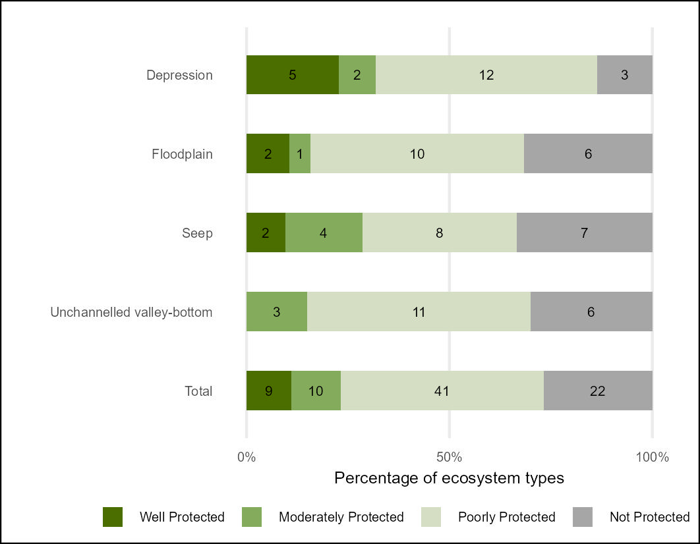

## **Workflows for undertaking the (inland) Wetland Ecosystem Protection Level (EPL) assessment**

### **National Biodiversity Assessment - South Africa**

*South African National Biodiversity Institute (SANBI)*

July 2025

#### **Summary**

This repository contains a workflow that results in the NBA 2025 Ecosystem Protection Level indicators for Wetland Ecosystems of South Africa following the methods of van [Deventer et al., 2019.](http://hdl.handle.net/20.500.12143/5847)

The Quarto document [EPL_wet.qmd](https://github.com/askowno/EPL_riv/blob/main/EPL_wet.qmd) describes the import of Protected Areas time series data - prepared in ARCPRO by SANBI - based on the South African Protected Areas Database (SAPAD) 2024Q4 (Department of Forestry Fisheries and Environment) and the import of the South African wetland database (version x) prepared by SANBI. The data were combined (intersection) using the sf package in R and summarised using the tidyverse.

Protection Level is an indicator developed in South Africa that measures the representation of ecosystem types within the PA network. The extent of each ecosystem type within the PA network is expressed as a proportion of the total extent. Four classes of Ecosystem Protection Level which is calculated per ecosystem type (n= ).

-   Well Protected: 100% of the PA target with PA network

-   Moderately Protected: 50% to 99% of PA target within the PA network

-   Poorly Protected: 5% to 49% of PA target within the PA network

-   Not Protected: less than 5% of PA target within the PA network

The PA target was historically set at 20% for freshwater ecosystems, but with the adoption of the 30% targets for Target 3 of the Global Biodiversity Framework - the PA target was increased to 30% in the EPL calculations (previous time points [2018] were recalculated using this higher target). Ecosystem condition data is based on the Wet Health model (Collins et al., 2025). Following van Deventer et al., 2019 only wetlands in an A or B condition (i.e. natural / near natural) are considered to contribute towards ecosystem representation within the Protected Areas network.

#### **Results:**

Overall per-ecosystem type EPL results [epl_wet_metrics_per_type.csv](outputs/epl_wet_metrics_per_type.csv)

Summary table - count of wetland ecosystem types per HGM zone per EPL category [epl24_wet_sum_count.csv](https://github.com/askowno/EPL_riv/blob/main/outputs/epl24_wet_sum_count.csv)

Summary table - extent of wetland per HGM zone per EPL category [epl24_wet_sum_ext.csv](outputs/epl24_rwet_sum_ext.csv)

